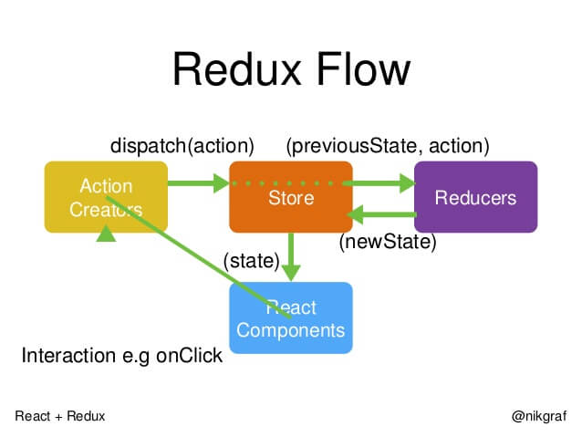
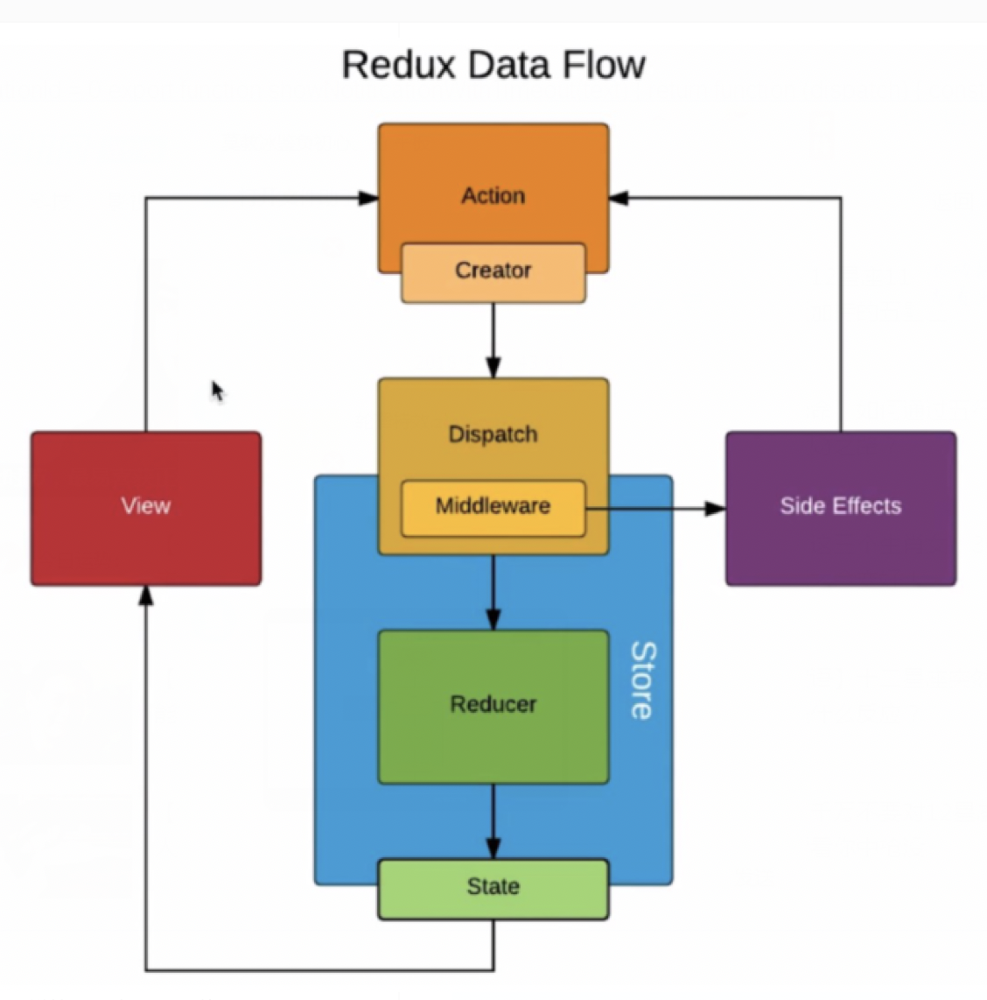

主要内容：
- 组件通信
- 为什么React并不推荐优先考虑使用Context？
- Redux 原理及工作流程
- 在React中页面重新加载时怎样保留数据？React 数据持久化有什么实践吗？

参考资料：  
[React入门教程](http://caibaojian.com/react/flux.html)   
[Redux 入门教程（一）：基本用法](http://www.ruanyifeng.com/blog/2016/09/redux_tutorial_part_one_basic_usages.html)   
[Redux 入门教程（二）：中间件与异步操作](http://www.ruanyifeng.com/blog/2016/09/redux_tutorial_part_two_async_operations.html)

# 组件通信
组件通信的方式有：props、Context（跨层级通信）、发布订阅模式、Redux或Mobx等全局状态管理⼯具
## 父子组件
- props：父组件通过传递给子组件的props进行通信，子组件不能直接更新父组件传递过来的数据，而是需要通过调用父组件传递过来的方法去更新数据。

## 跨级组件
- props：父组件向子组件的子组件进行通信，可以使用props，组件之间一层一层进行传递，但是如果层级很深就增加了复杂度，而且有些props可能对于某些中间组件是不需要的。
- context：context相当于一个大容器，可以把要通信的内容放在这个容器中，这样不管嵌套多深，都可以随意取用，因此，对于跨越多层的全局数据可以使用context使用。例如当前认证的⽤户、主题或⾸选语⾔。

## 非嵌套关系组件
没有任何包含关系的组件，包括兄弟组件以及不在同一个父级中的非兄弟组件。
- 使用自定义事件通信（发布订阅模式）
- 通过redux等进行全局状态管理

# 为什么React并不推荐优先考虑使用Context？
- 处于实验阶段，在后面的版本中可能有较大变化，会给升级带来较大影响和麻烦
- context的更新需要通过setState触发，但是在进行跨组件访问时，如果中间的子组件通过一些方法不影响更新（比如shouldComponentUpdate返回false），那么就无法保证context的更新一定使用context的子组件，因此其可靠性有待关注
- 尽管不建议在app根中使用context，但是独有组件而言，由于影响范围小于app，如果可以做到高内聚，不破坏组件树之间的依赖关系，可以考虑使用context

简而言之，只要你能确保Context是可控的，使用Context并无大碍，甚至如果能够合理的应用，Context其实可以给React组件开发带来很强大的体验。

# Redux 原理及工作流程
Redux是一个用来管理数据状态的UI状态的JS应用工具。随着JavaScript单页应用（SPA）开发日趋复杂，管理不断变化的 state 日益困难。单纯的Redux是一个状态机，是没有ui呈现的，react-redux作用是将Redux的状态机和React的UI呈现绑定在一起，当你dispatch action改变state的时候，会自动更新页面。

- 没有redux，组件间的传值需要传递。redux就是把组件之间的数据放到一个公用的存储区域store去存储，组件改变数据就不需要传递了，改变store里面的数据，其它组件会感知到改变，再来取数据。
- redux实质：Redux = Reducer+Flux，Redux基于简化版本的Flux框架，Flux是Facebook开发的一个框架。
- store是唯一的,只有store能够改变自己的内容,Reducer必须是纯函数(给定固定的输入，就一定会有固定的输出，而且不会有任何副作用)
- 中间件是对dispatch方法的一个封装或升级（中间是指action和reducer的中间），中间件（以redux-thunk为例）会根据所传的参数的不同执行不同的事情，若参数是对象的话会直接传给store，当传递给reducer的是一个函数的话，那么就先把函数执行结束，他会自己「吃掉」这个函数，不会传递给 reduces，防止 reduces 遇到一个函数而不知所措。redux-thunk中间件可以让action创建函数先不返回一个action对象，而是返回一个函数，函数传递一个参数(dispatch),在函数体内进行业务逻辑的封装。

# 在React中页面重新加载时怎样保留数据？React 数据持久化有什么实践吗？
## React 数据持久化有什么实践吗？
在react中，通过redux存储全局数据时，如果用户刷新了页面，那么通过redux存储的全局数据就会全部清空，此时就会有全局数据持久化存储的需求。首先想到的就是localStorage，localStorage是没有时间限制的数据存储，可以通过它来实现数据的持久化存储。

但是在已经使用redux来管理和存储全局数据的基础上，再去使用localStorage来读写数据，这样不仅是工作量巨大，还容易出错，此时就轮到**redux-persist**这个结合了redux来达到持久数据存储功能的框架出场了。**redux-persist**会将redux的store中的数据缓存到浏览器的localStorage中。

## 在React中页面重新加载时怎样保留数据？
- redux-persist：redux数据持久化好帮手
- data.js：使用webpack构建的项目，可以新建文件data.js，将数据保存在其中，跳转页面后获取
- localStorage：在进入选择地址页面之前，componentWillUnMount时，将数据存储到localStorage中，每次进入页面读取localStorage，返回或进入除了选择地址以外的页面，清掉存储的localStorage
- history API： History API 的pushState函数可以给历史记录关联一个任意的可序列化state，所以可以在路由push的时候将当前页面的一些信息存到state中，下次返回到这个页面的时候就能从state里面取出离开前的数据重新渲染。react-router 直接可以支持。这个方法适合一些需要临时存储的场景。

[History.pushState()-MDN](https://developer.mozilla.org/zh-CN/docs/Web/API/History/pushState)

