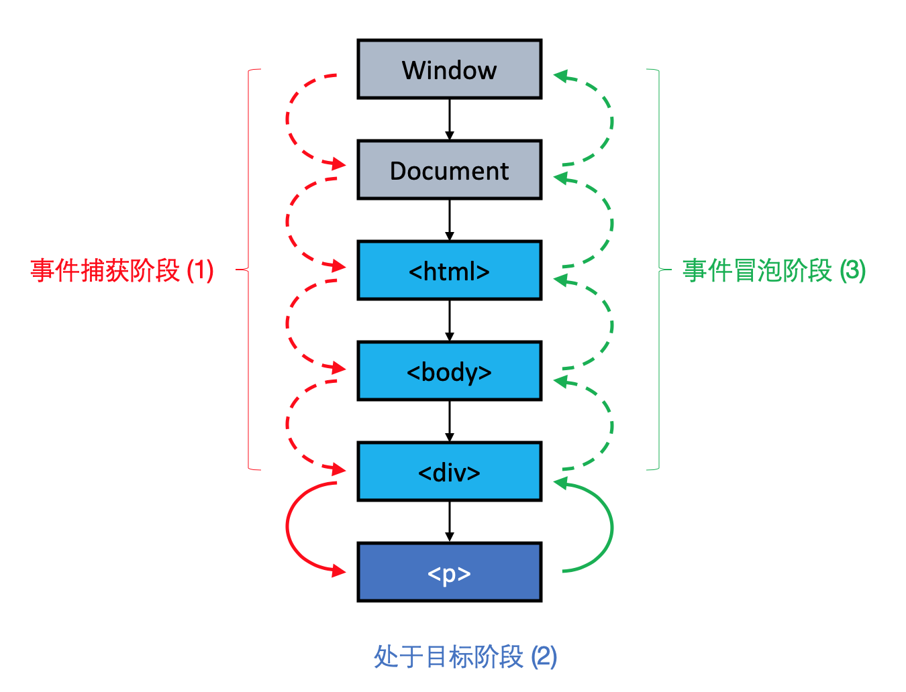
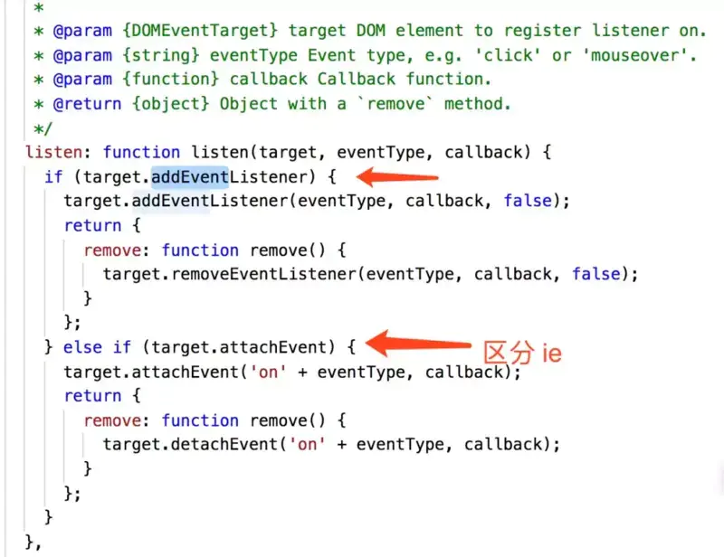

主要内容：
- 浏览器事件机制
- React事件绑定机制
- React事件和原生事件有什么区别？React事件和原生事件的执行顺序，可以混用吗
- React事件如何解决跨浏览器兼容
- stopPropagation 与 stopImmediatePropagation


# 浏览器事件机制
DOM 事件流，包含三个流程：事件捕获阶段、目标阶段、事件冒泡阶段。

> W3C协会早在1988年就开始了DOM标准的制定，W3C DOM标准可以分为 DOM1、DOM2、DOM3 三个版本。   
> 从 DOM2 开始，DOM 的事件传播分三个阶段进行：事件捕获阶段、处于目标阶段和事件冒泡阶段。

```js
<html>
    <body>
        <div id="outer">
	    <p id="inner">Click me!</p>
	</div>
    </body>
</html>
```
如果点击p元素，那么 DOM 事件流如下图：



- （1）事件捕获阶段：事件对象通过目标节点的祖先 Window 传播到目标的父节点。
- （2）处于目标阶段：事件对象到达事件目标节点。如果阻止事件冒泡，那么该事件对象将在此阶段完成后停止传播。
- （3）事件冒泡阶段：事件对象以相反的顺序从目标节点的父项开始传播，从目标节点的父项开始到 Window 结束。


# React事件绑定机制
考虑到浏览器的兼容性和性能问题，React基于Virtual Dom实现了一个SyntheticEvent（合成事件）层，我们所定义的事件处理器会接收到一个SyntheticEvent对象的实例。与原生事件直接在元素上注册的方式不同的是，react的合成事件不会直接绑定到目标dom节点上，而是用事件委托机制，以队列方式，从触发事件的组件向父组件回溯直到document节点，因此react组件上声明的事件最终绑定到了document上。用一个统一的监听器去监听，这个监听器上保存着目标节点与事件对象的映射，当组件挂载或卸载时，只是在这个统一的事件监听器上插入或删除一些对象；当事件发生时，首先被这个统一的事件监听器处理，然后在映射里找到真正的事件处理函数并调用。

好处：
- 减少内存消耗，提升性能，不需要注册那么多的事件了，一种事件类型只在document上注册一次
- 统一规范，解决ie事件兼容问题，简化事件逻辑
- 对开发者友好


React Event的主要四个文件：
- ReactBrowerEventEmitter.js——负责节点绑定的回调函数，该回调函数执行过程中构建合成事件对象，获取组件实例的绑定回调并执行，若有state变更，则重绘组件
- ReactEventListener.js——负责事件注册和事件分发
- ReactEventEmitter——负责事件的执行
- EventPluginHub.js——负责事件的存储
- ReactEventEmitterMixin.js——负责事件的合成


# React事件和原生事件有什么区别？React事件和原生事件的执行顺序，可以混用吗
## React事件和原生事件有什么区别?
示例：
```js
export default class Test extends React.Component {
    componentDidMount() {
        document.querySelector('#btn').addEventListener('click', (e) => {
            console.log('A inner listener')
            setTimeout(() => {
                console.log('B inner listener timer', e.type)
            })
        })

        document.body.addEventListener('click', (e) => {
            console.log('C document listener')
        })

        window.addEventListener('click', (e) => {
            console.log('D window listener')
        })
    }

    outClick(e) {
        setTimeout(() => {
            console.log('E out timer', e.type)
        })
        console.log('F out e', e.type)
    }

    innerClick = (e) => {
        console.log('G inner e',e.type)
        e.stopPropagation()
    }

    render() {
        return (
            <div onClick={this.outClick}>
                <button id="btn" onClick={this.innerClick}>点我</button>
            </div>
        )

    }
}
```

点击button最后输出：A C G B，且B处的type为click，而G处的type为null。

解析：
- 1.捕获阶段：几个事件addEventListener都没有第三个参数，也就是采取默认值false，即事件在冒泡阶段执行，因此对于原生事件在捕获阶段没有响应。而在react的合成事件只实现了事件冒泡，综上，捕获阶段没有响应。
- 2.事件绑定阶段：button上挂载了原生事件，输出A；setTimeout中的B进入event loop。innerClick事件属于react的合成事件，被挂在到document上，此时不会输出G。
- 3.冒泡阶段：div，同理，不会响应；继续冒泡
- 4.冒泡阶段：document，先响应document的原生事件，输出C；再由里向外响应合成事件队列，输出G，由于innerClick内设置了**e.stopPropagation()**，阻止了冒泡，因此父元素的事件没有执行。**React合成事件执行e.stopPropagation()不会影响document层级之前的原生事件冒泡。但是会影响document之后的原生事件。所以没有执行body的事件响应函数。**
- 5.最后处理event loop上的事件，即输出B

事件池：
[react官网-事件池](https://react.docschina.org/docs/legacy-event-pooling.html)
在react中，合成事件被调用后，合成事件对象会被重用，所有属性被置为null
event.constructor.release(event);
所以题目中outClick中通过异步方式访问e.type是取不到任何值的，如果需要保留属性，可以调用event.persist()事件，会保留引用。

事件池的作用：节省内存，不会频繁的创建和销毁事件对象。

**总结**
- 1.命名规范不同：合成事件的属性名是采用驼峰形式
- 2.合成事件只支持事件冒泡；原生事件可以配置addEventListener的第三个参数来指定事件是在捕获还是冒泡阶段执行
- 3.事件挂载目标不同：原生事件挂载在目标节点上；合成事件挂载在document上
- 4.this指向不同：合成事件中的this一般指向当前组件，如果不绑定this就是undefined；对于原生事件，如果onevent事件属性定义的时候将this作为参数，在函数中获取到该参数就是dom对象，能获取到当前dom，如果是在方法中直接访问this，this就执行当前函数所在的作用域，或者说调用函数的对象。
- 5.事件对象不同：原生js中事件对象是原生事件对象，存在浏览器兼容性；react中的事件对象是react将原生事件对象（event）进行了跨浏览器包装过的合成事件（SyntheticEvent），为了性能考虑，执行完后，合成事件的事件属性将不能再访问。
## React事件和原生事件的执行顺序，可以混用吗
已知：react的所有事件都挂载到document上，当真实dom触发后冒泡到document后才会对react事件进行处理。因此原生事件会先执行，再执行react合成事件，最后执行真正在document上挂载的事件。

不要将合成事件与原生事件混用。执行React事对象件的e.stopPropagation()可以阻止React事件冒泡。但是不能阻止原生事件冒泡；反之，在原生事件中的阻止冒泡行为，却可以阻止 React 合成事件的传播。因为无法将事件冒泡到document上导致的。


# React事件如何解决跨浏览器兼容
事件处理程序将传递**SyntheticEvent**的实例，这是一个跨浏览器原生事件包装器。具有与浏览器原生事件相同的接口，包括**stopPropagation()**和**preventDefault()**，在所有浏览器中他们工作方式都相同。

react事件在给document注册事件的时候也是对兼容性做了处理：


# stopPropagation 与 stopImmediatePropagation
## js中的stopPropagation 与 stopImmediatePropagation
两者都可以阻止事件冒泡，区别如下：
- stopPropagation：不会影响该事件的其他监听方法执行（一个元素绑定了多个同类事件（比如click），且父元素也绑定了该类事件，那么在元素调用**stopPropagation**方法后，父元素不会执行同类事件，但是该元素绑定的多个同类事件会依次执行。）
- stopImmediatePropagation：会阻止该事件后面的监听方法执行（一个元素绑定了多个同类事件（比如click），且父元素也绑定了该类事件，那么在元素调用**stopImmediatePropagation**方法后，父元素不会执行同类事件，该元素执行完当前事件，绑定的同类事件也不会执行。）

## react中的stopPropagation 与 stopImmediatePropagation
- stopImmediatePropagation：如果有多个相同类型事件的事件监听函数绑定到同一个元素，则当该类型的事件触发时，事件会按被添加的顺序执行。如果其中某个监听函数执行了**stopImmediatePropagation**方法，则剩下的监听函数就不会执行。
  - 比如：当合成事件和dom事件都绑定在document上时，react的处理是合成事件应该是先放进去的所以会先触发，在这种情况下，原生事件对象的stopImmediatePropagation能做到阻止进一步触发document DOM事件。
- 合成事件上的**stopPropagation**能阻止react模拟的事件冒泡，并不能阻止dom事件的冒泡
- dom事件上的**stopPropagation**可以阻止合成事件的冒泡


参考文档
[【React】354- 一文吃透 React 事件机制原理](https://mp.weixin.qq.com/s/8KrgoeLSuZ5-p-0cDZeb8A)   
[「React进阶系列」史上最全React事件机制详解](https://www.jianshu.com/p/41776f2f4d8b)   
[深入理解React：事件机制原理](https://www.cnblogs.com/forcheng/p/13187388.html)