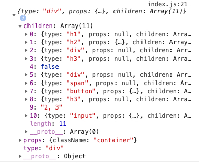
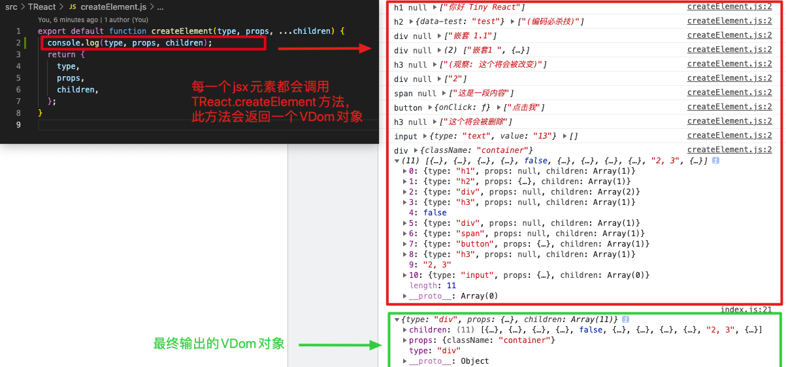
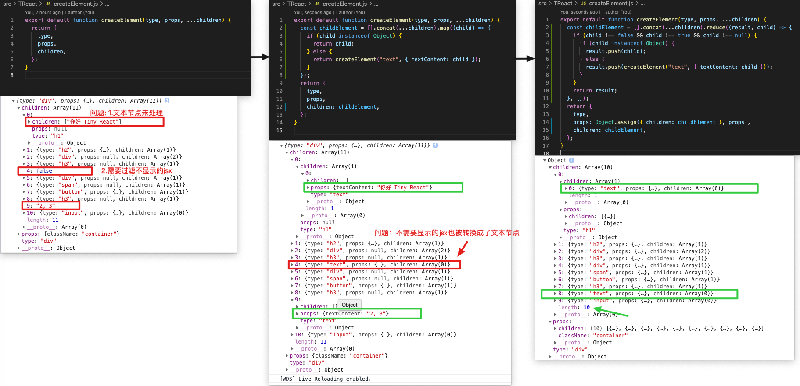

# 一. babel 插件，转换 jsx

## 1.创建/编写.babelrc 文件，配置@babel/preset-react，将 pragma 默认项 React.createElement 转换成 TReact.createElement

[babel-preset-react](https://www.babeljs.cn/docs/babel-preset-react)

```react
{
    "presets": [
        "@babel/preset-env",
        [
            "@babel/preset-react",
            {
                "pragma": "TReact.createElement"
            }
        ]
    ]
}
```

## 2.创建/编写 TReact/createElement.js 文件

```
export default function createElement(type, props, ...children) {
  return {
    type,
    props,
    children,
  };
}

```

## 3. 创建/编写 src/index.js

```
import TReact from "./TReact";

const virtualDOM = (
  <div className="container">
    <h1>你好 Tiny React</h1>
    <h2 data-test="test">(编码必杀技)</h2>
    <div>
      嵌套1 <div>嵌套 1.1</div>
    </div>
    <h3>(观察: 这个将会被改变)</h3>
    {2 == 1 && <div>如果2和1相等渲染当前内容</div>}
    {2 == 2 && <div>2</div>}
    <span>这是一段内容</span>
    <button onClick={() => alert("你好")}>点击我</button>
    <h3>这个将会被删除</h3>
    2, 3
    <input type="text" value="13" />
  </div>
);

console.log(virtualDOM);
```

## 总结：

此时可以看到浏览器终端输出：



这是因为在执行到“console.log(virtualDOM);”这行代码时，由于 babel 的设置，每一个 jsx 元素都会去调用 TReact.createElement 方法，这个方法会返回一个 VDom 对象：



# 二. 完善 CreateElement 方法，在创建 VDom 过程中把文本字符串转换成对象类型

转换过程中需要注意布尔值节点和 null 值节点

```
export default function createElement(type, props, ...children) {
  const childElement = [].concat(...children).map((child) => {
    if (child instanceof Object) {
      return child;
    } else {
      return createElement("text", { textContent: child });
    }
  });
  return {
    type,
    props,
    children: childElement,
  };
}
```



# 三、将 VDom 转换成真实 Dom，并渲染

## 1.在 html 文件中创建父级元素

```
<!DOCTYPE html>
<html lang="en">
   ...
   <body>
+    <div id="root"></div>
   </body>
</html>
```

## 2.创建外部方法 render 以及 内部方法 diff、mountElement、 mountNativeElement

### 2-1.创建 TReact/render.js 文件，方法的作用就是将 VDom 对象 转换成真实 dom 对象

TReact/render.js

```
import diff from "./diff";
export default function render(virtualDOM, container, oldDOM) {
  diff(virtualDOM, container, oldDOM);
}
```

在 src/index.js 文件中调用 render 方法。

```
  import TReact from "./TReact";
+ const root = document.getElementById("root");
  const virtualDOM = (...);
  console.log(virtualDOM);
+ TReact.render(virtualDOM, root);
```

### 2-2.创建内部方法 diff、mountElement、 mountNativeElement

TReact/diff.js

```
import mountElement from "./mountElement";
export default function diff(virtualDOM, container, oldDOM) {
  // 判断oldDOM是否存在
  if (!oldDOM) {
    mountElement(virtualDOM, container);
  }
}
```

TReact/mountElement.js

```
import mountNativeElement from "./mountNativeElement";

export default function mountElement(virtualDOM, container) {
  // Component VS NativeElement
  mountNativeElement(virtualDOM, container);
}

```

TReact/mountNativeElement.js

```
import mountElement from "./mountElement";

export default function mountNativeElement(virtualDOM, container) {
  let newElement = null;
  if (virtualDOM.type === "text") {
    // 文本节点
    newElement = document.createTextNode(virtualDOM.props.textContent);
  } else {
    // 元素节点
    newElement = document.createElement(virtualDOM.type);
  }

  // 递归创建子节点
  virtualDOM.children.forEach((child) => {
    mountElement(child, newElement);
  });
  console.log(newElement);
  // 将转换之后的DOM对象放置在页面中
  container.appendChild(newElement);
}

```

此时，jsx 元素已经可以显示在页面中了。

# 三、为 DOM 对象添加属性

## 1.创建 TReact/updateNodeElement.js 文件

```
export default function updateNodeElement(newElement, virtualDOM) {
  // 获取节点对应的属性对象
  const newProps = virtualDOM.props;
  Object.keys(newProps).forEach((propName) => {
    // 获取属性值
    const newPropsValue = newProps[propName];
    // 判断属性是否是事件属性 onClick => click
    if (propName.slice(0, 2) === "on") {
      // 事件名称
      const eventName = propName.toLocaleLowerCase().slice(2);
      // 为元素添加事件
      newElement.addEventListener(eventName, newPropsValue);
    } else if (propName === "value" || propName === "checked") {
      newElement[propName] = newPropsValue;
    } else if (propName !== "children") {
      if (propName === "className") {
        newElement.setAttribute("class", newPropsValue);
      } else {
        newElement.setAttribute(propName, newPropsValue);
      }
    }
  });
}
```

## 2.在创建元素节点之后，调用 updateNodeElement 方法，为 DOM 添加属性

```
+ import updateNodeElement from "./updateNodeElement";
  export default function createDOMElement(virtualDOM) {
    if (virtualDOM.type === "text") {...} else {
      // 元素节点
      newElement = document.createElement(virtualDOM.type);
      // 为元素添加属性
+     updateNodeElement(newElement, virtualDOM);
    }
  }
```
